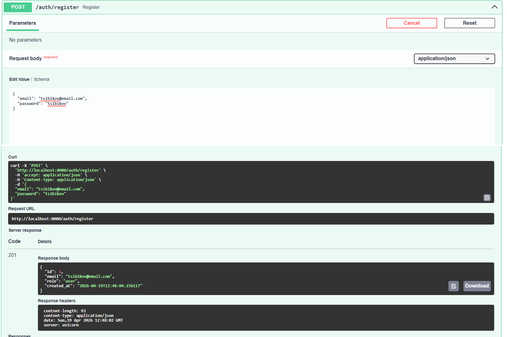
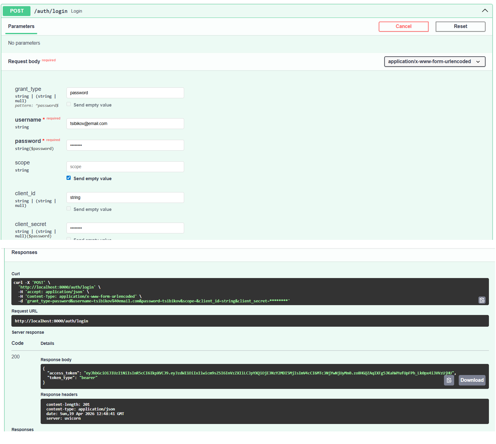
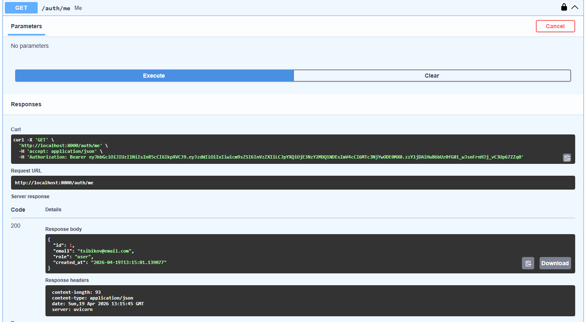
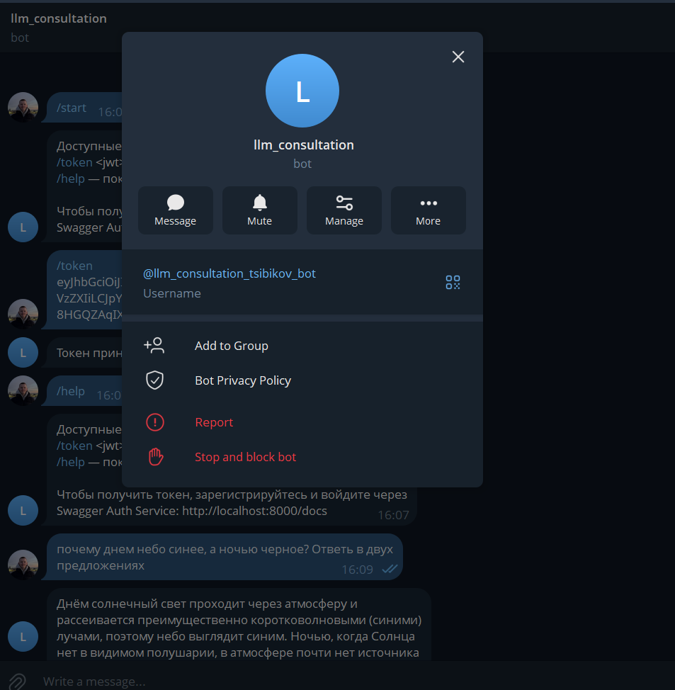
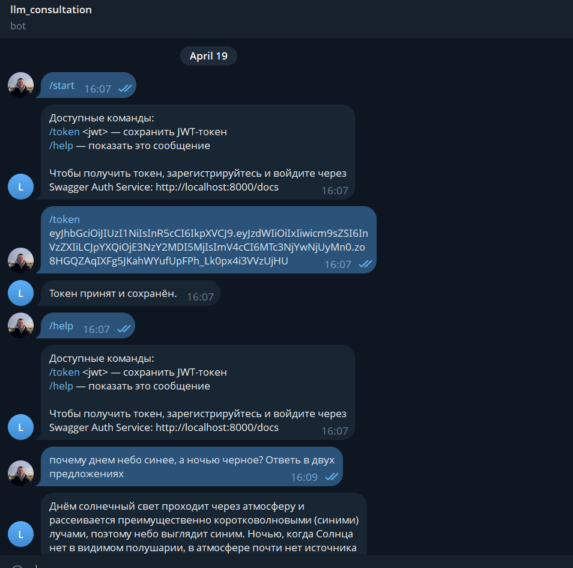
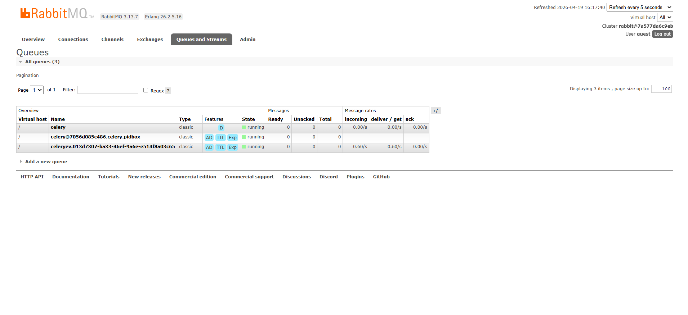
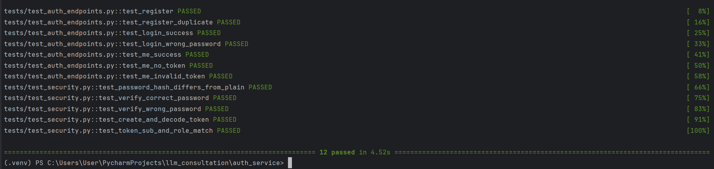
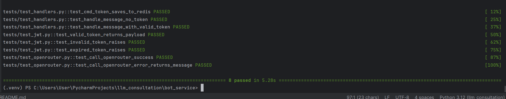

# Система LLM-консультаций

Распределённая двухсервисная система для LLM-консультаций через Telegram с JWT-аутентификацией.

## Архитектура

```
Пользователь
    │
    ├── Swagger (:8000) ──► Auth Service (FastAPI + SQLite)
    │                              │
    │                         выдаёт JWT
    │                              │
    └── Telegram Bot ──────────────┘
              │          (валидирует JWT)
              │
              ▼
         Bot Service
              │
              ▼
          RabbitMQ  ──►  Celery Worker  ──►  OpenRouter LLM
                               │
                             Redis
                      (токены + результаты)
```

## Сервисы

### Auth Service (порт 8000)

Отвечает исключительно за управление пользователями и выпуск JWT. Не содержит логики Telegram.

| Эндпоинт | Описание |
|----------|----------|
| `POST /auth/register` | Регистрация пользователя |
| `POST /auth/login` | Вход, возвращает JWT |
| `GET /auth/me` | Профиль по JWT |
| `GET /health` | Проверка работоспособности |

Swagger: `http://localhost:8000/docs`

### Bot Service (порт 8001)

Telegram-бот, принимающий только валидные JWT от Auth Service. Не содержит логики регистрации.

| Команда | Описание |
|---------|----------|
| `/start`, `/help` | Справка |
| `/token <jwt>` | Сохранить JWT (привязывается к Telegram user_id в Redis) |
| Любой текст | Запрос к LLM через очередь |

### Асинхронная цепочка

1. Бот получает сообщение, проверяет JWT из Redis
2. Публикует задачу в RabbitMQ
3. Celery-воркер забирает задачу, вызывает OpenRouter
4. Ответ отправляется пользователю через Telegram

## Стек технологий

| Компонент | Технология |
|-----------|-----------|
| Auth API | FastAPI + SQLAlchemy async + SQLite |
| Бот | aiogram 3.x |
| Очередь задач | Celery + RabbitMQ |
| Хранилище состояний | Redis |
| LLM | OpenRouter API |
| Пакетный менеджер | uv |

## Запуск

```bash
docker compose up --build
```

После запуска:
- Auth Service Swagger: `http://localhost:8000/docs`
- RabbitMQ UI: `http://localhost:15672` (guest / guest)

## Сценарий работы

1. Открыть `http://localhost:8000/docs`
2. Зарегистрироваться через `POST /auth/register` с email вида `tsibikov@email.com`
3. Войти через `POST /auth/login`, скопировать `access_token`
4. Отправить боту в Telegram: `/token <access_token>`
5. Отправить любой вопрос — бот ответит через LLM

## Тестирование

```bash
# Auth Service
cd auth_service
uv run pytest tests/ -v

# Bot Service
cd bot_service
uv run pytest tests/ -v
```

Тесты запускаются без Docker и внешних сервисов (fakeredis, respx, SQLite in-memory).

### Структура тестов

**Auth Service:**
- `test_security.py` — юнит-тесты хеширования паролей и генерации JWT
- `test_auth_endpoints.py` — интеграционные тесты всех эндпоинтов, включая негативные сценарии

**Bot Service:**
- `test_jwt.py` — юнит-тесты валидации JWT (валидный, невалидный, истёкший)
- `test_handlers.py` — мок-тесты обработчиков Telegram (fakeredis, мок Celery)
- `test_openrouter.py` — интеграционные тесты клиента OpenRouter (respx)

## Демонстрация работы

### Swagger — регистрация (`POST /auth/register`)



### Swagger — вход (`POST /auth/login`)



### Swagger — профиль (`GET /auth/me`)



### Telegram-бот




### RabbitMQ — очереди Celery



### Тесты

#### Auth Service


#### Bot Service


## Безопасность

- Пароли хранятся только в виде bcrypt-хеша
- JWT подписан алгоритмом HS256 (общий секрет между сервисами)
- Bot Service никогда не создаёт и не изменяет JWT
- Секреты хранятся в `.env` файлах, исключённых из git
